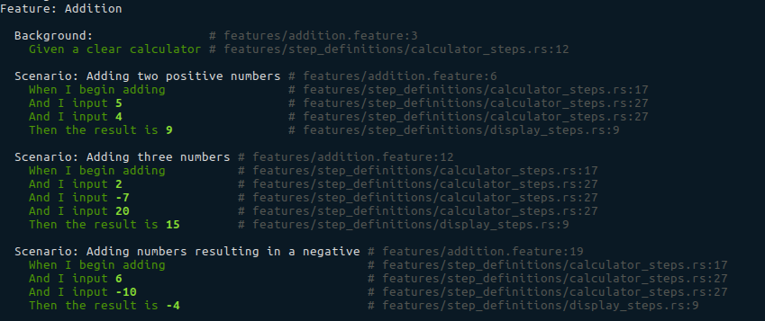

# Calculator Example

## Project Layout

- `/features`
This is the typical directory Cucumber code is placed in. For now, this structure is mandatory as it is what Ruby's Cucumber runner expects.

  - `/features/step_definitions`
  This is the typical directory Cucumber step definitions are placed in. This example places them here in a module.
    - `/features/step_defintions/cucumber_rust.wire`
    This is a mandatory file that indicates to Ruby Cucumber that there is a server out there to handle executing our steps. Thats this library!

- `/support`
This is a typical directory for support code for step execution in Cucumber. In this project, the World is defined here.

- `cuke.rs`
This the test running code. It can have any name, but to be executed, the `Cargo.toml` must know where this is.

- `*.feature`
These are the "features" that the application claims to have. See general Cucumber documentation for more information.

- `Cargo.toml`
This file is Rust-normal, except for the special treatment for binary projects. Cucumber needs a crate to test against, so you __must__ build a lib if you want to test it directly.

## Example output for one Feature

